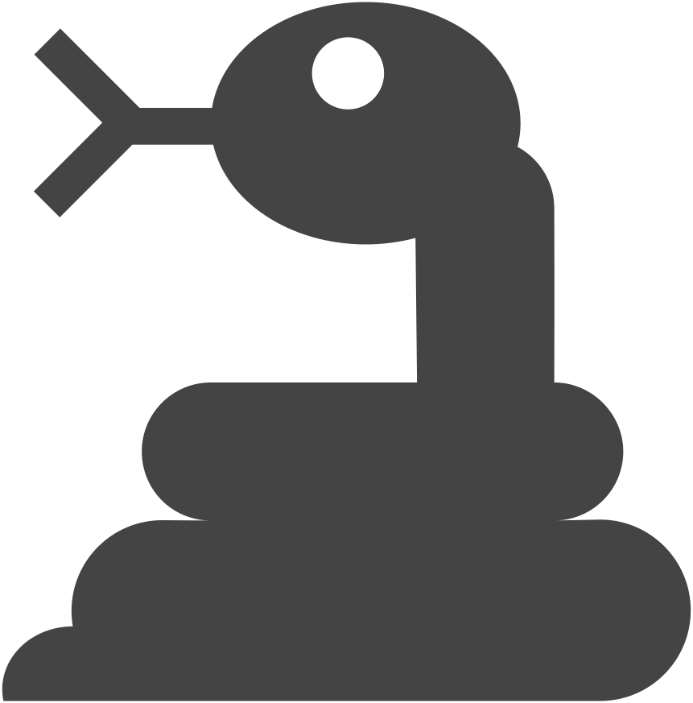
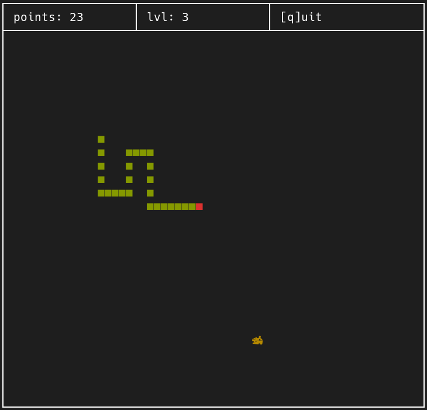
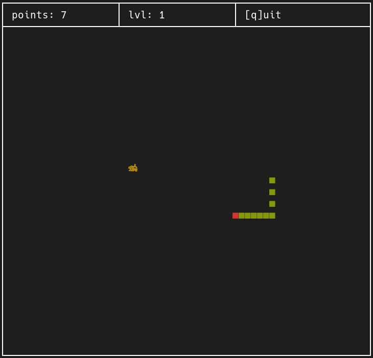

<div align="center" style="margin: 20px">
	<picture>
		<source media="(prefers-color-scheme: dark)" srcset="./screen/anaconda_light.svg" width="40%">
		
	</picture>
	<h1>Anaconda</h1>
	<p>An snake game written in C for your UNIX-like terminal</p>
</div>

Anaconda is an snake game written in C as a porfolio project and for practice on [The C Programming Language](https://en.wikipedia.org/wiki/The_C_Programming_Language) book written by [Dennis Ritchie](https://en.wikipedia.org/wiki/Dennis_Ritchie) and [Brian Kernighan](https://en.wikipedia.org/wiki/Brian_Kernighan).

## Preview
<div>
	
	
</div>

## Build

> [!WARNING]
> This program is only for UNIX-like operating systems like Linux... and it doesn't work in Windows.

Recommanded requirements:
- [**Nerd Font**](https://github.com/ryanoasis/nerd-fonts)

You can clone the project and compile it yourself:
```bash
git clone "https://github.com/empitrix/anaconda.git"
cd ./anaconda
cc ./snake.c -o ./snake.out
```
Now you can run `./snake.out` to play the game.


- You can quiting the game by pressing `q`.

<!--
## Keys
|    Key        |    Action          |
|:--------------|:-------------------|
| `q`           |   quit game        |
| `ARROW-UP`    |   Move snake up    |
| `ARROW-LEFT`  |   Move snake left  |
| `ARROW-RIGHT` |   Move snake right |
| `ARROW-DOWN`  |   Move snake down  |


## TODO
- [ ] Support for Windows
-->
